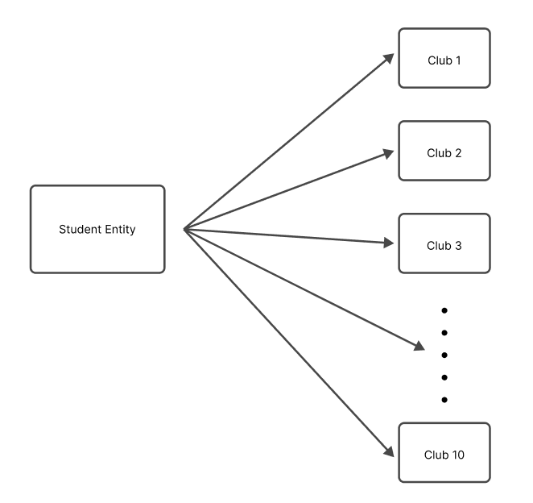

# Introduction

In today's data-driven world, storing and managing information efficiently is crucial for businesses and organizations of all sizes. Relational databases have emerged as a powerful solution for organizing and manipulating data in a structured and scalable manner. In this blog post, we'll explore the fundamentals of relational databases, their management systems, and the principles that underpin effective database design.

## What is a Database?

A database is a structured collection of data that is organized and stored in a way that facilitates efficient retrieval, manipulation, and management. Think of it as a digital filing cabinet, where instead of physical folders and documents, you have tables and records neatly organized for easy access.

## What is a Relational Database?

A relational database is a type of database that organizes data into tables (relations) with rows (records) and columns (fields). These tables are interconnected through relationships, allowing data to be accessed and combined in various ways. Imagine a collection of spreadsheets, each representing a different aspect of your data, but with the ability to link and combine information across them seamlessly.

## RDBMS

A Relational Database Management System (RDBMS) is a software application designed to create, manage, and interact with relational databases. It provides a structured framework for storing, retrieving, and manipulating data within the database. Some popular examples of RDBMS include MySQL, PostgreSQL, Oracle, and Microsoft SQL Server.

# Introduction to SQL

SQL (Structured Query Language) is the standard programming language used to interact with relational databases. It allows you to create, read, update, and delete data within the database, as well as define and modify the database structure itself. SQL is like a universal language that enables you to communicate with different RDBMS platforms.

## Naming Conventions

In SQL, following consistent naming conventions is crucial for clarity and maintainability. Here's an example:

```sql
-- Good naming conventions
CREATE TABLE customers (
   customer_id INT PRIMARY KEY,
   first_name VARCHAR(100),
   last_name VARCHAR(100),
   email VARCHAR(100)
);
```

## What is Database Design?

Database design is the process of creating an efficient and organized structure for storing and managing data in a database. It involves defining tables, columns, relationships, and constraints to ensure data integrity, minimize redundancy, and optimize performance. Proper database design is the foundation for building robust and scalable applications.


## Data Integrity

Data integrity refers to the accuracy, consistency, and reliability of data stored in a database. It ensures that the data follows specific rules and constraints, preventing errors and inconsistencies. There are three types of data integrity:

1. Entity Integrity: Ensures each row in a table is uniquely identifiable by a primary key, and the primary key cannot have null values.
2. Referential Integrity: Maintains relationships between tables by ensuring foreign key values in one table match the primary key values in another table.
3. Domain Integrity: Enforces valid entries for a given column by restricting the data type, format, and range of values that can be stored.

```sql
-- Example: Enforcing data integrity
CREATE TABLE orders (
    order_id INT PRIMARY KEY, -- Entity integrity
    customer_id INT FOREIGN KEY REFERENCES customers(customer_id), -- Referential integrity
    order_date DATE NOT NULL, -- Domain integrity
    total_amount DECIMAL(10, 2) CHECK (total_amount >= 0) -- Domain integrity
);
```

## Database Terms

- Table: A collection of related data organized in rows and columns.
- Row: A single instance or entry in a table (also known as a record or tuple).
- Column: A specific characteristic or property of the data in a table (also known as a field or attribute).
- Primary Key: A column or combination of columns that uniquely identifies each row in a table.
- Foreign Key: A column or combination of columns that references the primary key of another table, establishing a relationship between the two tables.
- Join: An operation that combines rows from two or more tables based on a related column.
- Index: A data structure that improves the performance of data retrieval operations by creating a sorted representation of the data in a table.
  View: A virtual table that is dynamically generated from one or more underlying tables.
- Stored Procedure: A pre-compiled collection of SQL statements that can be executed as a single unit.
- Trigger: A special type of stored procedure that is automatically executed when a specific event occurs in a table, such as an INSERT, UPDATE, or DELETE statement.

## Atomic Values

In database design, it's important to store atomic values, which means storing the smallest pieces of information that cannot be further divided. This principle helps maintain data integrity and avoid redundancy.

For example, instead of storing a customer's full name in a single column, it's better to separate it into first name and last name columns. This way, you can easily search, sort, or manipulate each part of the name independently.

```sql
-- Example: Storing atomic values
CREATE TABLE customers (
    customer_id INT PRIMARY KEY,
    first_name VARCHAR(50),
    last_name VARCHAR(50),
    email VARCHAR(100)
);
```

# Introduction to Keys

Keys are essential components in database design that help ensure data integrity and establish relationships between tables. They serve as unique identifiers for records and enable efficient data retrieval and manipulation.

## Primary Key Index

A primary key is a column or a combination of columns that uniquely identifies each record in a table. It ensures that each record is unique and can be easily located. Primary keys are typically indexed to improve query performance.

```sql
CREATE TABLE customers (
    customer_id INT PRIMARY KEY,
    first_name VARCHAR(50),
    last_name VARCHAR(50),
    email VARCHAR(100)
);
```

## Look up Table

A lookup table, also known as a reference table or a code table, is a table that contains predefined sets of values that can be used to populate columns in other tables. Lookup tables help maintain data integrity by ensuring consistency and reducing redundancy.

```sql
-- Lookup table for product categories
CREATE TABLE product_categories (
    category_id INT PRIMARY KEY,
    category_name VARCHAR(100)
);

-- Products table referencing the lookup table
CREATE TABLE products (
    product_id INT PRIMARY KEY,
    product_name VARCHAR(100),
    category_id INT,
    FOREIGN KEY (category_id) REFERENCES product_categories(category_id)
);
```

## Superkey and Candidate Key

A superkey is a set of one or more columns in a table that uniquely identifies each record. A candidate key is a minimal superkey, meaning it contains no unnecessary columns. In other words, a candidate key is a superkey with the minimal number of columns required to uniquely identify each record.

## Primary Key and Alternate Key

A primary key is a candidate key chosen as the main unique identifier for a table. An alternate key, also known as a unique key, is any other candidate key that could have been chosen as the primary key but was not.

```sql
CREATE TABLE employees (
    employee_id INT PRIMARY KEY,
    email VARCHAR(100) UNIQUE, -- Alternate key
    first_name VARCHAR(50),
    last_name VARCHAR(50)
);
```

## Surrogate Key and Natural Key

A surrogate key is an artificial key (often a sequential number or a GUID) that is used as the primary key in a table. It has no inherent meaning or relationship to the data itself. A natural key, on the other hand, is a key derived from the data itself, such as an employee ID or a product code.

```sql
-- Surrogate key
CREATE TABLE orders (
    order_id INT PRIMARY KEY IDENTITY(1,1), -- Surrogate key
    customer_name VARCHAR(100),
    order_date DATE
);

-- Natural key
CREATE TABLE products (
    product_code VARCHAR(10) PRIMARY KEY, -- Natural key
    product_name VARCHAR(100),
    price DECIMAL(10,2)
);
```

## Should I use Surrogate Keys or Natural Keys?

The choice between surrogate keys and natural keys depends on several factors, including the nature of the data, the likelihood of data changes, and the potential for duplication or conflicts.

Surrogate keys are often preferred because they are:

- Immutable: They do not change over time, even if the data changes.
- Guaranteed unique: They are generated by the database system, ensuring uniqueness.
- Opaque: They do not reveal any information about the data itself, which can be beneficial for security and privacy.

Natural keys, on the other hand, can be advantageous when:

- The data has inherent uniqueness, such as product codes or employee IDs.
- The data is unlikely to change over time, reducing the risk of conflicts or duplication.
- There is a need for human-readable and meaningful identifiers.

## Foreign Key

A foreign key is a column or a combination of columns in one table that references the primary key of another table. It establishes a link between the two tables and enforces referential integrity, ensuring that data in the child table is valid and consistent with the data in the parent table.

```sql
CREATE TABLE orders (
    order_id INT PRIMARY KEY,
    customer_id INT,
    order_date DATE,
    FOREIGN KEY (customer_id) REFERENCES customers(customer_id)
);
```

## NOT NULL Foreign Key

In some cases, it might be desirable to have a NOT NULL constraint on a foreign key column, meaning that the column cannot have a null value. This constraint ensures that every record in the child table is associated with a valid record in the parent table.

```sql
CREATE TABLE orders (
    order_id INT PRIMARY KEY,
    customer_id INT NOT NULL,
    order_date DATE,
    FOREIGN KEY (customer_id) REFERENCES customers(customer_id)
);
```

## Foreign Key Constraints

Foreign key constraints define the rules for referential integrity between tables. These constraints can include actions to be taken when a referenced record in the parent table is updated or deleted, such as:

- CASCADE: When a record in the parent table is updated or deleted, the corresponding records in the child table are also updated or deleted.
- SET NULL: When a record in the parent table is updated or deleted, the corresponding foreign key values in the child table are set to NULL.
- NO ACTION: When a record in the parent table is updated or deleted, the corresponding foreign key values in the child table remain unchanged, and the operation is rolled back if it violates referential integrity.

```sql
CREATE TABLE orders (
    order_id INT PRIMARY KEY,
    customer_id INT,
    order_date DATE,
    FOREIGN KEY (customer_id) REFERENCES customers(customer_id) ON UPDATE CASCADE ON DELETE SET NULL
);
```

## Simple Key, Composite Key, Compound Key

- A simple key is a single column used as a primary key or a foreign key.
- A composite key is a combination of two or more columns used as a primary key or a foreign key.
- A compound key is a combination of two or more simple keys used as a foreign key.

```sql
-- Simple key
CREATE TABLE orders (
    order_id INT PRIMARY KEY,
    ...
);

-- Composite key
CREATE TABLE order_items (
    order_id INT,
    product_id INT,
    quantity INT,
    PRIMARY KEY (order_id, product_id)
);

-- Compound key
CREATE TABLE shipments (
    shipment_id INT PRIMARY KEY,
    order_id INT,
    product_id INT,
    FOREIGN KEY (order_id, product_id) REFERENCES order_items(order_id, product_id)
);
```

## Relationships

Relationships are the cornerstone of relational databases, allowing you to connect and combine data from different tables. There are three main types of relationships:


## One-to-One Relationships

In a one-to-one relationship, each record in one table is associated with exactly one record in another table, and vice versa. For example, consider a database where each employee has one and only one manager, and each manager manages one and only one employee. This type of relationship is relatively rare in practice.


## One-to-Many Relationships

In a one-to-many relationship, each record in one table (the "one" side) can be associated with multiple records in another table (the "many" side). For example, in a database for a school, one teacher can teach multiple classes, but each class is taught by only one teacher.



## Many-to-Many Relationships

In a many-to-many relationship, each record in one table can be associated with multiple records in another table, and vice versa. For example, in a database for a university, a student can enroll in multiple courses, and each course can have multiple students enrolled.


## Summary of Relationships

- One-to-One: One record in Table A is related to one and only one record in Table B, and vice versa.
- One-to-Many: One record in Table A can be related to multiple records in Table B, but one record in Table B can be related to only one record in Table A.
- Many-to-Many: Multiple records in Table A can be related to multiple records in Table B, and vice versa.

## Designing Relationships (SQL Implementation)

1. Designing One-to-One Relationships

   To design a one-to-one relationship, you can either include all the columns from both tables in a single table or create two separate tables and use a foreign key constraint to link them.

```sql
-- Option 1: Single table
CREATE TABLE employees (
employee_id INT PRIMARY KEY,
first_name VARCHAR(50),
last_name VARCHAR(50),
manager_first_name VARCHAR(50),
manager_last_name VARCHAR(50)
);

-- Option 2: Two tables with foreign key
CREATE TABLE employees (
employee_id INT PRIMARY KEY,
first_name VARCHAR(50),
last_name VARCHAR(50),
manager_id INT UNIQUE,
FOREIGN KEY (manager_id) REFERENCES employees(employee_id)
);
```

2. Designing One-to-Many Relationships

   To design a one-to-many relationship, you typically create two tables: a parent table (the "one" side) and a child table (the "many" side). The child table includes a foreign key column that references the primary key of the parent table.

```sql
-- Parent table
CREATE TABLE teachers (
    teacher_id INT PRIMARY KEY,
    first_name VARCHAR(50),
    last_name VARCHAR(50)
);

-- Child table
CREATE TABLE classes (
    class_id INT PRIMARY KEY,
    class_name VARCHAR(100),
    teacher_id INT,
    FOREIGN KEY (teacher_id) REFERENCES teachers(teacher_id)
);

```

3. Designing Many-to-Many Relationships

   To design a many-to-many relationship, you typically create a third table (called a junction table or associative table) that links the two main tables together. This junction table includes foreign key columns that reference the primary

```sql
-- Table 1
CREATE TABLE students (
    student_id INT PRIMARY KEY,
    first_name VARCHAR(50),
    last_name VARCHAR(50)
);

-- Table 2
CREATE TABLE courses (
    course_id INT PRIMARY KEY,
    course_name VARCHAR(100),
    description TEXT
);

-- Junction or Intemediary table
CREATE TABLE enrollments (
    enrollment_id INT PRIMARY KEY,
    student_id INT,
    course_id INT,
    FOREIGN KEY (student_id) REFERENCES students(student_id),
    FOREIGN KEY (course_id) REFERENCES courses(course_id)
);

```

## Parent Tables and Child Tables

In a one-to-many or many-to-many relationship, the table on the **"one"** side is often referred to as the parent table, while the table on the **"many"** side is called the child table. The child table contains a foreign key that references the primary key of the parent table.

For example, in the teacher-class relationship, the `teachers` table is the parent table, and the `classes` table is the child table. Similarly, in the student-course relationship, the `students` and `courses` tables are parent tables, while the `enrollm`

# Introduction to Entity Relationship Modeling

Entity Relationship Modeling (ER Modeling) is a technique used in database design to represent the logical structure of a database visually. It helps identify the entities (tables), attributes (columns), and relationships between them, making it easier to understand and communicate the database design.

ER diagrams consist of the following components:

- Entities: Represented by rectangles, entities are the tables or objects in the database.
- Attributes: Listed inside the entity rectangle, attributes are the columns or fields that describe the entity.
- Relationships: Represented by lines connecting entities, relationships depict the associations between entities.

## Cardinality

Cardinality defines the numerical relationship between two entities. It specifies the maximum number of instances of one entity that can be associated with a single instance of another entity. The most common cardinalities are:

- One-to-One (1:1): One instance of Entity A can be associated with at most one instance of Entity B, and vice versa.
- One-to-Many (1:N): One instance of Entity A can be associated with multiple instances of Entity B, but one instance of Entity B can be associated with only one instance of Entity A.
- Many-to-Many (M:N): Multiple instances of Entity A can be associated with multiple instances of Entity B, and vice versa.
  In ER diagrams, cardinality is represented using specific notation, such as a single line for one-to-one, a line with an arrowhead for one-to-many, and a line with arrowheads at both ends for many-to-many relationships.
  

## Modality

Modality refers to whether the existence of an entity instance depends on its relationship with another entity. There are two types of modality:

- Partial modality: The existence of an instance does not depend on its relationship with another entity. For example, a customer can exist without having any orders.
- Total modality: The existence of an instance depends on its relationship with another entity. For example, an order item cannot exist without an order.

In ER diagrams, modality is represented using specific notation, such as a single bar for partial modality and a double bar for total modality.

---

# Introduction to Database Normalization

Database normalization is the process of organizing data in a database to reduce redundancy, minimize data anomalies (insertion, update, and deletion anomalies), and improve data integrity. It involves breaking down a database into smaller tables and defining relationships between them based on specific rules or normal forms.

The primary goals of database normalization are:

1. Eliminating redundant data
2. Ensuring data integrity
3. Facilitating data manipulation and maintenance

There are several normal forms in database normalization, each building upon the previous one. The most commonly used normal forms are:

- First Normal Form (1NF)
- Second Normal Form (2NF)
- Third Normal Form (3NF)

## 1NF (First Normal Form of Database Normalization)

The First Normal Form (1NF) is the most basic form of normalization. It states that an attribute (column) in a table must have atomic values, meaning each cell in the table should contain a single value, not a set of values.

For example, consider a table with a column named "PhoneNumbers" that stores multiple phone numbers for a customer. This violates 1NF because the column contains a set of values instead of a single value. To conform to 1NF, you would need to separate the phone numbers into individual columns or create a separate table for phone numbers.

```sql
-- Violates 1NF
CREATE TABLE customers (
    customer_id INT PRIMARY KEY,
    name VARCHAR(100),
    phone_numbers VARCHAR(200) -- Stores multiple phone numbers, violating 1NF
);

-- Conforms to 1NF
CREATE TABLE customers (
    customer_id INT PRIMARY KEY,
    name VARCHAR(100),
    phone1 VARCHAR(20),
    phone2 VARCHAR(20),
    phone3 VARCHAR(20)
);
```

## 2NF (Second Normal Form of Database Normalization)

The Second Normal Form (2NF) builds upon 1NF by addressing the issue of partial dependencies. A table is in 2NF if it is in 1NF and every non-prime attribute (column) is fully dependent on the entire primary key.

In other words, if a table has a composite primary key (consisting of multiple columns), then all non-key columns must depend on the entire primary key, not just a part of it.

For example, consider a table with a composite primary key of (student_id, course_id) and a column grade. If the grade column depends only on the course_id and not on the combination of student_id and course_id, then the table violates 2NF.

```sql
-- Violates 2NF
CREATE TABLE student_courses (
    student_id INT,
    course_id INT,
    course_name VARCHAR(100), -- Depends only on course_id, not the entire primary key
    grade CHAR(2),
    PRIMARY KEY (student_id, course_id)
);

-- Conforms to 2NF
CREATE TABLE student_courses (
    student_id INT,
    course_id INT,
    grade CHAR(2),
    PRIMARY KEY (student_id, course_id)
);

CREATE TABLE courses (
    course_id INT PRIMARY KEY,
    course_name VARCHAR(100)
);

```

## 3NF (Third Normal Form of Database Normalization)

The Third Normal Form (3NF) builds upon 2NF by addressing the issue of transitive dependencies. A table is in 3NF if it is in 2NF and every non-prime attribute is non-transitively dependent on the primary key.

In other words, if a non-key column is dependent on another non-key column, then the table violates 3NF, and the non-key columns should be separated into their own table.

For example, consider a table with columns `student_id`, `student_name`, `class_id`, and `class_name`. The `student_name` column depends on the `student_id`, and the `class_name` column depends on the `class_id`. However, the `class_name` column also transitively depends on the `student_id` through the `class_id` column. This violates 3NF.

```sql
-- Violates 3NF
CREATE TABLE student_classes (
    student_id INT,
    student_name VARCHAR(100),
    class_id INT,
    class_name VARCHAR(100),
    PRIMARY KEY (student_id, class_id)
);

-- Conforms to 3NF
CREATE TABLE students (
    student_id INT PRIMARY KEY,
    student_name VARCHAR(100)
);

CREATE TABLE classes (
    class_id INT PRIMARY KEY,
    class_name VARCHAR(100)
);

CREATE TABLE student_classes (
    student_id INT,
    class_id INT,
    PRIMARY KEY (student_id, class_id),
    FOREIGN KEY (student_id) REFERENCES students(student_id),
    FOREIGN KEY (class_id) REFERENCES classes(class_id)
);
```

By following the principles of database normalization, you can create well-structured and efficient databases that minimize redundancy, maintain data integrity, and facilitate data manipulation and maintenance.

## Indexes (Clustered, Nonclustered, Composite Index)

Indexes are data structures that improve the performance of data retrieval operations in a database. They create a sorted representation of the data in a table, allowing for faster searches and queries. There are several types of indexes:

Clustered Index: A clustered index physically reorders the rows in a table based on the index key values. Each table can have only one clustered index.
Nonclustered Index: A nonclustered index is a separate object that contains the index key values and pointers to the corresponding rows in the table. A table can have multiple nonclustered indexes.
Composite Index: A composite index is an index that includes multiple columns in the index key. It can be either clustered or nonclustered.

```sql
-- Clustered index
CREATE CLUSTERED INDEX idx_customers_name
ON customers (last_name, first_name);

-- Nonclustered index
CREATE NONCLUSTERED INDEX idx_orders_date
ON orders (order_date);

-- Composite index
CREATE INDEX idx_products_category_price
ON products (category_id, price);
```

## Data Types

In the world of databases, data types are like different shapes of containers that hold specific types of information. Just as you wouldn't store liquids in a basket or solid objects in a jar, databases need to enforce specific data types to ensure data integrity and consistency.

Some common data types in SQL include:

- INT or INTEGER: Stores whole numbers, like 42 or 17.
- FLOAT or DOUBLE: Stores decimal numbers, like 3.14159 or 0.00005.
- VARCHAR or TEXT: Stores text data, like names or descriptions.
- DATE or DATETIME: Stores date and time values, like '2023-05-06' or '2024-01-01 12:34:56'.
- BOOLEAN: Stores true/false values, like 1 (true) or 0 (false).

Choosing the right data type is crucial because it affects how the data is stored, queried, and manipulated. For example, trying to store a large string in an INT column would result in an error or data truncation.

```sql
CREATE TABLE users (
    id INT PRIMARY KEY,
    name VARCHAR(50) NOT NULL,
    age INT,
    is_active BOOLEAN DEFAULT 1
);
```

In this example, we create a users table with columns for `id` (integer), `name` (string of up to 50 characters), `age` (integer), and `is_active` (boolean, with a default value of `1` or true).

---

# Introduction to Joins

Joins are like bridges that connect different tables in a database, allowing you to combine and retrieve related data from multiple sources. They are a fundamental concept in relational databases and are essential for querying and manipulating data efficiently.


## Inner Join

An inner join is like a friendly handshake between two tables, where only the rows that have matching values in both tables are included in the result set. It's a way to combine data from multiple tables based on a common column or set of columns.

```sql
SELECT users.name, orders.order_date
FROM users
INNER JOIN orders ON users.id = orders.user_id;
```

In this example, we retrieve the `name` column from the `users` table and the `order_date` column from the `orders` table, but only for rows where the `id` in the `users` table matches the `user_id` in the `orders` table.

## Inner Join on 3 Tables (Example)

Let's say we have three tables: users, orders, and products. We want to retrieve the user's name, the order date, and the product name for each order. We can achieve this by performing an inner join across all three tables:

```sql
SELECT users.name, orders.order_date, products.product_name
FROM users
INNER JOIN orders ON users.id = orders.user_id
INNER JOIN products ON orders.product_id = products.id;
```

Here, we first join the `users` and `orders` tables on the `id` and `user_id` columns. Then, we join the result of that join with the `products` table on the `product_id` and `id` columns. This way, we can retrieve data from all three tables in a single query, but only for rows where the join conditions are met.

## Introduction to Outer Joins

While inner joins are like friendly handshakes, outer joins are more like welcoming hugs. They include not only the matching rows from both tables but also the non-matching rows from one or both tables, depending on the type of outer join.

## Right Outer Join

A right outer join is like a warm hug from the right table to the left table. It includes all rows from the right table, along with the matching rows from the left table. If there are no matching rows in the left table, the result will contain `NULL` values for the left table's columns.

```sql
SELECT users.name, orders.order_date
FROM users
RIGHT OUTER JOIN orders ON users.id = orders.user_id;
```

In this example, we retrieve all rows from the `orders` table (the right table), along with the matching name values from the `users` table (the left table). If an order doesn't have a matching user, the `name` column will contain `NULL`.

## JOIN with NOT NULL Columns

Sometimes, you may want to perform a join only on columns that are not null. This can be useful when you want to exclude rows with missing data from the result set.

```sql
SELECT users.name, orders.order_date
FROM users
INNER JOIN orders ON users.id = orders.user_id AND users.name IS NOT NULL;
```

In this example, we perform an inner join between the `users` and `orders` tables, but we add an additional condition `users.name IS NOT NULL` to ensure that only rows with non-null `name` values are included in the result set.

## Outer Join Across 3 Tables

Similar to the inner join example, we can perform outer joins across multiple tables. Let's say we want to retrieve all orders, along with the user's name and the product name, even if there are missing values in the `users` or `products` tables.

```sql
SELECT users.name, orders.order_date, products.product_name
FROM orders
LEFT OUTER JOIN users ON orders.user_id = users.id
LEFT OUTER JOIN products ON orders.product_id = products.id;
```

Here, we start with the `orders` table and perform a left outer join with both the `users` and `products` tables. This ensures that all orders are included in the result set, along with the matching user names and product names if available. If there are no matching rows in the `users` or `products` tables, the respective columns will contain `NULL` values.

## Alias

Aliases are like nicknames for tables or columns in SQL queries. They can make queries more readable and easier to understand, especially when dealing with long table or column names, or when referencing the same table multiple times in a query.

```sql
SELECT u.name, o.order_date, p.product_name
FROM users u
INNER JOIN orders o ON u.id = o.user_id
INNER JOIN products p ON o.product_id = p.id;

```

In this example, we use the aliases `u` for the `users` table, `o` for the `orders` table, and `p` for the `products` table. This makes the query more concise and easier to read, without having to repeat the full table names multiple times.

## Self Join

A self join is like a table having a conversation with itself. It's a way to join a table with itself, based on a specific condition or relationship within the same table. This can be useful when dealing with hierarchical or recursive data structures, such as employee-manager relationships or nested categories.

```sql
SELECT e.name AS employee, m.name AS manager
FROM employees e
LEFT OUTER JOIN employees m ON e.manager_id = m.id;
```

In this example, we perform a self join on the `employees` table to retrieve the name of each employee and their corresponding manager's name. We use a left outer join to ensure that all employees are included in the result set, even if they don't have a manager assigned.

---

# Database Markup Language (DBML)

Database Modeling Language (DBML) is a simple and intuitive markup language for describing the structure of relational databases. It provides a human-readable way to define tables, columns, relationships, and constraints, making it easy to communicate and collaborate on database designs.

## Getting Started with DBML

To get started with DBML, you'll need a text editor and a basic understanding of database concepts. Let's create our first DBML file:

```dbml
// my_database.dbml

Table users {
  id int [pk, increment]
  username varchar
  email varchar [unique]
  created_at datetime [default: `now()`]
}
```

In this example, we've defined a `users` table with columns for `id`, `username`, `email`, and `created_at`. The `[pk]` tag specifies that `id` is the primary key, `[increment]` indicates auto-incrementing, `[unique]` ensures uniqueness for the `email`, and `[default: now()]` sets the default value of `created_at` to the current timestamp.

## Creating Tables

DBML allows you to define multiple tables and their columns in a single file. Let's add more tables to our database:

```dbml
// my_database.dbml

Table users {
  id int [pk, increment]
  username varchar
  email varchar [unique]
  created_at datetime [default: `now()`]
}

Table posts {
  id int [pk, increment]
  title varchar
  content text
  user_id int [ref: > users.id]
  created_at datetime [default: `now()`]
}
```

In this example, we've added a `posts` table with columns for `id`, `title`, `content`, `user_id`, and `created_at`. The `[ref: > users.id]` tag establishes a foreign key relationship between the `user_id` column in the `posts` table and the `id` column in the `users` table.

## Defining Relationships

DBML supports various types of relationships between tables, including one-to-one, one-to-many, and many-to-many. Let's define some relationships in our database:


```dbml
// my_database.dbml

Table users {
  id int [pk, increment]
  username varchar
  email varchar [unique]
  created_at datetime [default: `now()`]
}

Table posts {
  id int [pk, increment]
  title varchar
  content text
  user_id int [ref: > users.id]
  created_at datetime [default: `now()`]
}

Ref: users.id < posts.user_id
```
In this example, we've defined a one-to-many relationship between the `users` and `posts` tables. The `Ref: users.id < posts.user_id` line specifies that the `id` column in the `users` table is referenced by the `user_id` column in the `posts` table.

## Adding Constraints

Constraints ensure data integrity and enforce rules on the database. DBML supports various constraints such as primary keys, foreign keys, unique constraints, and default values. Let's add some constraints to our tables:


```dbml
// my_database.dbml

Table users {
  id int [pk, increment]
  username varchar [unique]
  email varchar [unique]
  created_at datetime [default: `now()`]
}

Table posts {
  id int [pk, increment]
  title varchar
  content text
  user_id int [ref: > users.id]
  created_at datetime [default: `now()`]
}

Ref: users.id < posts.user_id
```


In this updated example, we've added a `[unique]` constraint to the `username` column in the `users` table to ensure that each username is unique.

## Documenting Your Database

DBML allows you to add comments and annotations to your database schema, making it easier to understand and maintain. Let's document our tables with comments:


```dbml
// my_database.dbml

Table users {
  id int [pk, increment] // Unique identifier for users
  username varchar [unique] // User's username
  email varchar [unique] // User's email address
  created_at datetime [default: `now()`] // Date and time when the user was created
}

Table posts {
  id int [pk, increment] // Unique identifier for posts
  title varchar // Title of the post
  content text // Content of the post
  user_id int [ref: > users.id] // ID of the user who created the post
  created_at datetime [default: `now()`] // Date and time when the post was created
}

Ref: users.id < posts.user_id // Relationship between users and posts
```
## Benefits of DBML

- Simple and human-readable syntax
- Database-agnostic approach
- Free visualization tool at [dbdiagram.io](dbdiagram.io)
- Consistent conventions for readability and maintainability
- Extensive documentation and examples