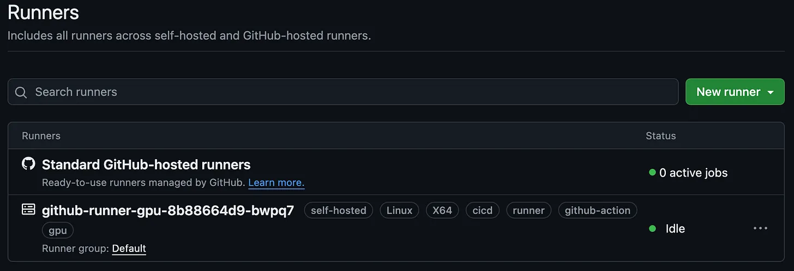

GitHub Actions is a powerful tool for automating your development workflow. While GitHub provides hosted runners, sometimes you need a custom environment. In this post, we'll walk through creating a Dockerfile to build your own GitHub Actions runner.

## **Why Build a Custom Runner?**

Before we dive into the technical details, let's consider why you might want to create your own runner:

1.  Specific software requirements.
    
2.  Enhanced security and control.
    
3.  Cost optimization for high-volume workflows.
    
4.  **Access to specialized hardware.**
    

Custom runners give you the flexibility to tailor your CI/CD environment to your exact needs.

## Notes

There are a few examples online of Github Runner Dockerfiles, and the goal of this article is to provide added value. I found it hard to find good examples to build a Github Runner that could use a GPU within Kubernetes at the time.

Even though the focus of this article is to make a GPU capable Github Runner, it’s not hard to switch back to a normal Github Runner by changing:

-   **FROM nvidia/cuda:12.5.1-runtime-ubuntu24.04** to **FROM ubuntu:latest**
    
-   Remove the RUN block that install the nvidia drivers for Docker.
    

## **The Dockerfile: Building Blocks**

Let's break down our Dockerfile into manageable sections. I was inspired greatly by this Dockerfile from [myoung34/docker-github-actions-runner](https://github.com/myoung34/docker-github-actions-runner) and therefore use the same [environment variables](https://github.com/myoung34/docker-github-actions-runner?tab=readme-ov-file#environment-variables).

You can find this version [here](https://github.com/plutov/packagemain/tree/master/github-runner-gpu).

### **Base Image and Environment Setup**

We start with an Ubuntu base image and set some essential environment variables:
```dockerfile
    FROM nvidia/cuda:12.5.1-runtime-ubuntu24.04
    
    ENV DEBIAN_FRONTEND=noninteractive
    ENV LANG=en_US.UTF-8
    ENV LANGUAGE=en_US.UTF-8
    ENV LC_ALL=en_US.UTF-8
    
    ENV AGENT_TOOLSDIRECTORY=/opt/hostedtoolcache
    ARG GH_RUNNER_VERSION="2.317.0"
    ARG TARGETPLATFORM
    
    RUN echo en_US.UTF-8 UTF-8 >> /etc/locale.gen
    RUN mkdir -p /opt/hostedtoolcache
```
### Installing Dependencies

This section ensures we have all the necessary tools installed.

Some of these dependencies are necessary for the next steps of this Dockerfile, things like Kubectl, Helm, Docker will need to be installed semi manually and requires to import GPG keys etc.

If you have other needs like other languages that need to be installed natively on your Github Runner, that’s where you should do it.
```dockerfile
    # Install necessary dependencies
    RUN apt-get update && apt-get install -y --no-install-recommends \
        lsb-release software-properties-common build-essential \
        gettext gnupg tar unzip zip zstd \
        apt-transport-https ca-certificates \
        wget curl jq yq rsync \
        zlib1g-dev libcurl4-openssl-dev inetutils-ping dirmngr \
        openssh-client locales dumb-init pass gosu sudo \
        python3-pip python3-setuptools python3 nodejs cmake yarn
```
### Other dependencies

_**Install Kubectl:**_
```dockerfile
    RUN curl -fsSL https://pkgs.k8s.io/core:/stable:/v1.30/deb/Release.key | sudo gpg --dearmor -o /etc/apt/keyrings/kubernetes-apt-keyring.gpg \
        && sudo chmod 644 /etc/apt/keyrings/kubernetes-apt-keyring.gpg \
        && echo 'deb [signed-by=/etc/apt/keyrings/kubernetes-apt-keyring.gpg] https://pkgs.k8s.io/core:/stable:/v1.30/deb/ /' | sudo tee /etc/apt/sources.list.d/kubernetes.list \
        && sudo chmod 644 /etc/apt/sources.list.d/kubernetes.list \
        && sudo apt-get update \
        && sudo apt-get install -y kubectl
```
_**Install Helm:**_
```dockerfile
    RUN curl https://baltocdn.com/helm/signing.asc | gpg --dearmor | sudo tee /usr/share/keyrings/helm.gpg > /dev/null \
        && sudo apt-get install apt-transport-https --yes \
        && echo "deb [arch=$(dpkg --print-architecture) signed-by=/usr/share/keyrings/helm.gpg] https://baltocdn.com/helm/stable/debian/ all main" | sudo tee /etc/apt/sources.list.d/helm-stable-debian.list \
        && sudo apt-get update \
        && sudo apt-get install -y helm
  ```  

_**Install Docker:**_
```dockerfile
    RUN sudo install -m 0755 -d /etc/apt/keyrings \
        && sudo curl -fsSL https://download.docker.com/linux/ubuntu/gpg -o /etc/apt/keyrings/docker.asc \
        && sudo chmod a+r /etc/apt/keyrings/docker.asc \
        && echo \
        "deb [arch=$(dpkg --print-architecture) signed-by=/etc/apt/keyrings/docker.asc] https://download.docker.com/linux/ubuntu \
        $(. /etc/os-release && echo "$VERSION_CODENAME") stable" | \
        sudo tee /etc/apt/sources.list.d/docker.list > /dev/null \
        && apt-get update \
        && sudo apt-get install -y docker-ce docker-ce-cli containerd.io docker-buildx-plugin docker-compose-plugin
```
_**Install nvidia drivers for Docker:**_
```dockerfile
    RUN curl -fsSL https://nvidia.github.io/libnvidia-container/gpgkey | sudo gpg --dearmor -o /usr/share/keyrings/nvidia-container-toolkit-keyring.gpg \
        && curl -s -L https://nvidia.github.io/libnvidia-container/stable/deb/nvidia-container-toolkit.list | \
        sed 's#deb https://#deb [signed-by=/usr/share/keyrings/nvidia-container-toolkit-keyring.gpg] https://#g' | \
        sudo tee /etc/apt/sources.list.d/nvidia-container-toolkit.list \
        && apt-get update \
        && apt-get install -y nvidia-docker2 nvidia-container-toolkit
```
_**Install Github CLI:**_
```dockerfile
    RUN wget -qO- https://cli.github.com/packages/githubcli-archive-keyring.gpg | sudo tee /etc/apt/keyrings/githubcli-archive-keyring.gpg > /dev/null \
        && sudo chmod go+r /etc/apt/keyrings/githubcli-archive-keyring.gpg \
        && echo "deb [arch=$(dpkg --print-architecture) signed-by=/etc/apt/keyrings/githubcli-archive-keyring.gpg] https://cli.github.com/packages stable main" | sudo tee /etc/apt/sources.list.d/github-cli.list > /dev/null \
        && sudo apt update \
        && sudo apt install gh -y
```
### Create a Runner User

Here we create a Group and a User, both called **runner**. Then we add this user to sudo and docker groups. We also let any user from the sudo group run any command without asking a password.
```dockerfile
    RUN groupadd -g 121 runner \
        && useradd -mr -d /home/runner -u 1001 -g 121 runner \
        && usermod -aG sudo runner \
        && usermod -aG docker runner \
        && echo '%sudo ALL=(ALL) NOPASSWD: ALL' >> /etc/sudoers
```
### Setup Github Runner Startup
```dockerfile
    WORKDIR /actions-runner
    COPY install_actions.sh /actions-runner
    
    RUN chmod +x /actions-runner/install_actions.sh \
        && /actions-runner/install_actions.sh ${GH_RUNNER_VERSION} ${TARGETPLATFORM} \
        && rm /actions-runner/install_actions.sh \
        && chown runner /_work /actions-runner /opt/hostedtoolcache
    
    COPY token.sh entrypoint.sh app_token.sh /
    RUN chmod +x /token.sh /entrypoint.sh /app_token.sh
    ENTRYPOINT ["/entrypoint.sh"]
    CMD ["./bin/Runner.Listener", "run", "--startuptype", "service"]
```
## **Deployment and Usage**

With our Dockerfile and startup script ready, deployment is straightforward:

1.  Build the Docker image
    
2.  Run the container with necessary environment variables
    

Example of environment variables:
```yaml
    - name: ACCESS_TOKEN
      value: mytoken
    - name: RUNNER_SCOPE
      value: "org"
    - name: ORG_NAME
      value: packagemain
    - name: RUN_AS_ROOT
      value: "true"
    - name: LABELS
      value: runner,github-action,gpu
    - name: RUNNER_WORKDIR
      value: /tmp/github-runner
    - name: DISABLE_AUTO_UPDATE
      value: "true"
```
For **ACCESS\_TOKEN** you should use a [Github personal access token](https://docs.github.com/en/authentication/keeping-your-account-and-data-secure/managing-your-personal-access-tokens).

The way the Dockerfile runs and is setup, if we keep the **auto update** the kubernetes healtcheck might consider it’s having issues and you would be in a perpetual loop try to update / not available / failing.

_**That’s one of the main improvement here, be able to auto update without Kubernetes thinking the pod is not responding.**_

Once your runner is deployed and registered you should be able to see it in Github’s UI in org settings (Actions → Runners):



## **Conclusion: Empowering Your CI/CD Pipeline**

By creating a custom GitHub Actions runner, you're taking control of your development pipeline. This Dockerfile provides a solid foundation that you can further customize to meet your specific needs.

Remember, the key to a successful custom runner is balancing flexibility with maintainability.

You can find all configuration in this [GitHub Repo](https://github.com/plutov/packagemain/tree/master/github-runner-gpu).

Happy building!